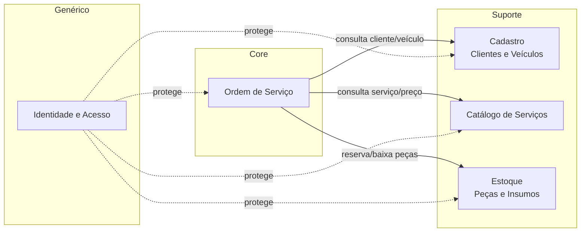
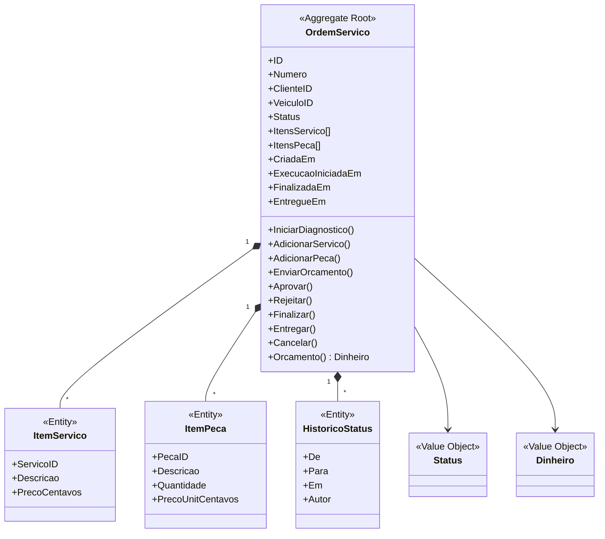
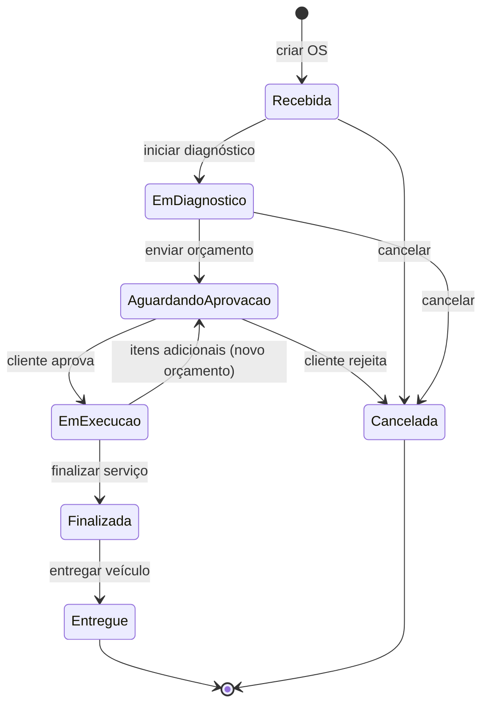

# 3. Modelagem de domínio (DDD)

## 3.1 Linguagem ubíqua

| Termo | Definição |
|-------|-----------|
| **Cliente** | Pessoa física ou jurídica dona do veículo, identificada por CPF/CNPJ |
| **Veículo** | Automóvel atendido, identificado pela placa |
| **Ordem de Serviço (OS)** | Registro que acompanha o atendimento de um veículo, da entrada à entrega |
| **Serviço** | Atividade de mão de obra do catálogo (ex.: alinhamento) com preço |
| **Peça** | Item físico substituível (ex.: pastilha de freio) |
| **Insumo** | Material consumível (ex.: óleo, aditivo) — tratado como Peça com tipo `INSUMO` |
| **Item de Serviço** | Serviço incluído em uma OS, com preço congelado |
| **Item de Peça** | Peça incluída em uma OS, com quantidade e preço congelados |
| **Orçamento** | Valor total calculado a partir dos itens da OS, submetido à aprovação |
| **Diagnóstico** | Avaliação técnica que define serviços e peças necessários |
| **Aprovação** | Autorização do cliente para executar o orçamento |
| **Estoque** | Quantidade disponível de uma peça |
| **Movimentação** | Registro de entrada, reserva ou baixa de estoque |
| **Tempo de execução** | Intervalo entre o início da execução e a finalização |

## 3.2 Subdomínios

| Subdomínio | Tipo | Justificativa |
|------------|------|---------------|
| **Ordem de Serviço** | Núcleo (core) | Diferencial e coração do negócio: fluxo, orçamento, aprovação |
| **Estoque** | Suporte | Necessário, mas com regras conhecidas |
| **Cadastro (Clientes e Veículos)** | Suporte | CRUD com validações |
| **Catálogo de Serviços** | Suporte | CRUD de preços |
| **Identidade e Acesso** | Genérico | Autenticação JWT, sem regra específica do negócio |

## 3.3 Contextos delimitados (Bounded Contexts)

Como o sistema é um **monolito modular**, cada contexto é um pacote/módulo isolado com API interna explícita.



**Relacionamentos entre contextos**

| De → Para | Padrão | Observação |
|-----------|--------|------------|
| OS → Cadastro | Customer/Supplier | OS referencia apenas `ClienteID` e `VeiculoID` |
| OS → Catálogo | Customer/Supplier | OS copia nome e preço (snapshot) |
| OS → Estoque | Customer/Supplier | Via interface (porta) `ControleEstoque` |
| Todos → IAM | Conformist | Middleware JWT |

Regra: **agregados de contextos diferentes se referenciam apenas por ID**.

## 3.4 Agregados, entidades e objetos de valor

### Contexto: Ordem de Serviço



- **Invariantes:** RN05, RN06, RN09, RN10, RN15.
- A transição de estado é **sempre** feita por métodos do agregado; nunca por atribuição direta ao campo.

### Contexto: Cadastro

| Elemento | Tipo | Invariantes |
|----------|------|-------------|
| `Cliente` | Aggregate Root | Documento válido e único (RN01) |
| `Documento` (CPF/CNPJ) | Value Object | Dígitos verificadores válidos, armazenado sem máscara |
| `Veiculo` | Aggregate Root | Placa válida e única, ano válido (RN02, RN03); referencia `ClienteID` |
| `Placa` | Value Object | Padrão antigo ou Mercosul, normalizada em maiúsculas |

### Contexto: Catálogo de Serviços

| Elemento | Tipo | Invariantes |
|----------|------|-------------|
| `Servico` | Aggregate Root | Nome único, preço ≥ 0, `Ativo` |

### Contexto: Estoque

| Elemento | Tipo | Invariantes |
|----------|------|-------------|
| `Peca` | Aggregate Root | SKU único, quantidade ≥ 0 (RN07), preço ≥ 0, tipo `PECA` ou `INSUMO`, `Ativo` |
| `MovimentacaoEstoque` | Entity | Tipo (`ENTRADA`, `BAIXA`, `ESTORNO`), quantidade, OS de origem |

### Contexto: Identidade e Acesso

| Elemento | Tipo | Invariantes |
|----------|------|-------------|
| `Usuario` | Aggregate Root | E-mail único, senha com hash bcrypt, perfil (`ADMIN`) |

## 3.5 Eventos de domínio

Eventos internos, publicados de forma síncrona em memória (sem broker no MVP).

| Evento | Origem | Efeito |
|--------|--------|--------|
| `OSCriada` | OS | Registra histórico |
| `DiagnosticoIniciado` | OS | Status → Em diagnóstico |
| `OrcamentoEnviado` | OS | Notifica o cliente (porta `Notificador`) |
| `OrcamentoAprovado` | OS | Estoque baixa as peças |
| `OrcamentoRejeitado` | OS | Cancela a OS; estorna estoque se houver |
| `ExecucaoIniciada` | OS | Grava `execucao_iniciada_em` |
| `OSFinalizada` | OS | Grava `finalizada_em`; alimenta o tempo médio |
| `VeiculoEntregue` | OS | Grava `entregue_em` |
| `EstoqueBaixo` **[Premissa]** | Estoque | Alerta quando abaixo do mínimo |

## 3.6 Máquina de estados da OS



| De | Para | Gatilho | Ator | Pré-condição |
|----|------|---------|------|--------------|
| — | Recebida | Criar OS | Atendente | Cliente e veículo válidos |
| Recebida | Em diagnóstico | Iniciar diagnóstico | Atendente/Mecânico | — |
| Em diagnóstico | Aguardando aprovação | Enviar orçamento | Atendente/Mecânico | ≥ 1 serviço (RN05) |
| Aguardando aprovação | Em execução | Aprovar | Cliente | Estoque suficiente (RN07) |
| Aguardando aprovação | Cancelada | Rejeitar | Cliente | — |
| Em execução | Aguardando aprovação | Incluir item adicional | Mecânico | Justificativa registrada |
| Em execução | Finalizada | Finalizar | Mecânico | — |
| Finalizada | Entregue | Entregar | Atendente | — |
| Recebida / Em diagnóstico | Cancelada | Cancelar | Atendente | — |

Qualquer outra transição é rejeitada com erro de domínio (`ErrTransicaoInvalida`).

> **Correspondência com o enunciado:** os seis status obrigatórios estão todos presentes; **Cancelada** é uma extensão (Premissa 4).

## 3.7 Serviços de domínio e portas

| Elemento | Responsabilidade |
|----------|------------------|
| `CalculadoraOrcamento` | Soma serviços e peças (RN06) |
| `ControleEstoque` (porta) | `Baixar(pecaID, qtd)`, `Estornar(...)`, `Disponivel(...)` |
| `Notificador` (porta) | `EnviarOrcamento(cliente, os)`; implementação de log no MVP |
| `Relogio` (porta) | Abstrai `time.Now()` para testes determinísticos |

## 3.8 Métrica: tempo médio de execução

```
tempo_medio = média( finalizada_em − execucao_iniciada_em )
              sobre OS com status Finalizada ou Entregue,
              opcionalmente filtrada por serviço e período
```

Exposta em `GET /api/v1/metricas/tempo-medio-execucao`.
