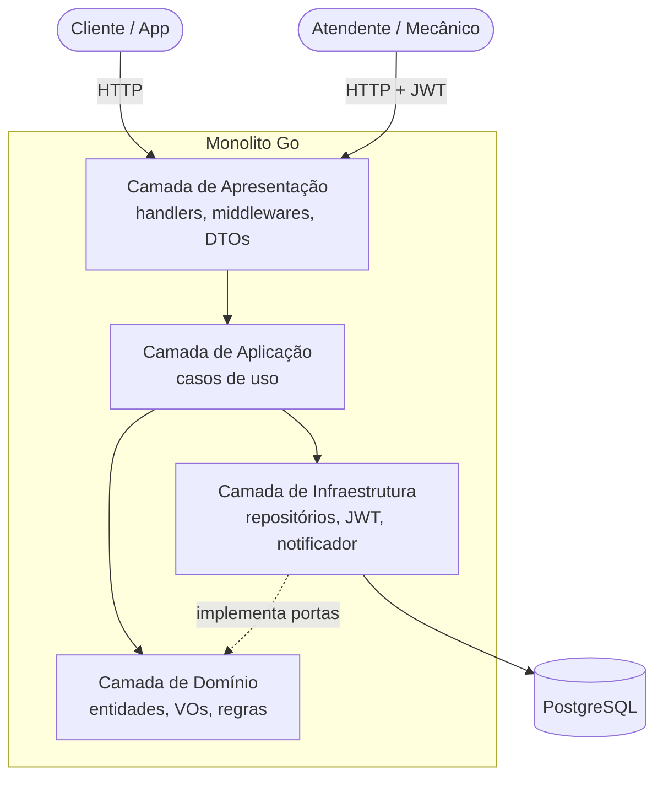
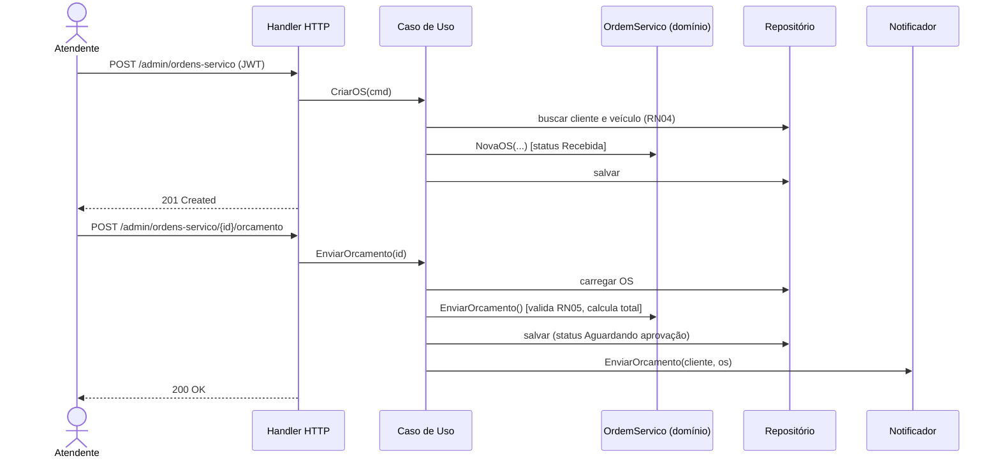
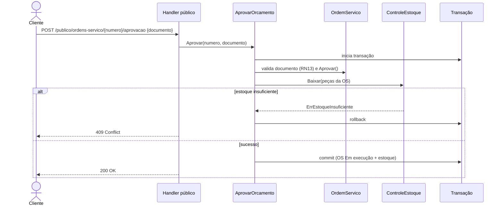

# 4. Arquitetura

## 4.1 Visão geral

Monolito **modular** em **camadas**, implantado como um único binário Go e um banco PostgreSQL.



## 4.2 Camadas e responsabilidades

| Camada | Responsabilidade | Pode depender de |
|--------|------------------|------------------|
| **Apresentação** (`interfaces/http`) | Rotas, validação de entrada, serialização, mapeamento de erros para HTTP, middleware JWT | Aplicação |
| **Aplicação** (`application`) | Casos de uso; orquestra domínio e transações; sem regra de negócio | Domínio |
| **Domínio** (`domain`) | Entidades, VOs, regras, eventos, **interfaces** de repositório e portas | Nenhuma (só stdlib) |
| **Infraestrutura** (`infrastructure`) | Postgres, JWT, bcrypt, notificador, relógio, config | Domínio |

**Regra de dependência:** as setas apontam para dentro. O domínio não conhece HTTP, SQL nem frameworks (inversão de dependência via interfaces).

## 4.3 Estrutura de pastas proposta

```
.
├── cmd/
│   └── api/main.go                 # composição (injeção de dependências)
├── internal/
│   ├── cadastro/                   # contexto: clientes e veículos
│   │   ├── domain/                 #   cliente.go, veiculo.go, documento.go, placa.go, repositorio.go
│   │   ├── application/            #   casos de uso
│   │   ├── infrastructure/         #   repositório postgres
│   │   └── http/                   #   handlers e DTOs
│   ├── catalogo/                   # contexto: serviços
│   ├── estoque/                    # contexto: peças e insumos
│   ├── ordemservico/               # contexto core
│   │   ├── domain/                 #   ordem_servico.go, status.go, orcamento.go, eventos.go
│   │   ├── application/            #   criar_os, enviar_orcamento, aprovar, finalizar...
│   │   ├── infrastructure/
│   │   └── http/
│   ├── identidade/                 # usuários e JWT
│   └── shared/                     # erros, dinheiro, relógio, logger, transação
├── migrations/                     # SQL versionado
├── docs/                           # esta documentação + swagger gerado
├── Dockerfile
├── docker-compose.yml
└── .env.example
```

> Cada contexto tem as quatro camadas internas. Contextos só se comunicam por **interfaces** declaradas no consumidor (ex.: `ordemservico` declara `ControleEstoque`; `estoque` a implementa), montadas em `cmd/api`.

## 4.4 Fluxo: abertura de OS e envio de orçamento



## 4.5 Fluxo: aprovação pelo cliente



## 4.6 Tratamento de erros

| Erro de domínio | HTTP |
|-----------------|------|
| Validação (CPF, placa, valores) | 422 Unprocessable Entity |
| Não encontrado | 404 |
| Transição inválida, estoque insuficiente, duplicidade | 409 Conflict |
| Não autenticado / token inválido | 401 |
| Sem permissão | 403 |
| Inesperado | 500 (sem vazar detalhes) |

Formato padrão (RFC 7807 simplificado):

```json
{ "codigo": "TRANSICAO_INVALIDA", "mensagem": "Não é possível finalizar uma OS que está Recebida", "detalhes": [] }
```

## 4.7 Transações e concorrência

- Cada caso de uso que altera OS e estoque executa em **uma única transação**.
- Baixa de estoque com `UPDATE pecas SET quantidade = quantidade - $1 WHERE id = $2 AND quantidade >= $1` (atômico, evita negativo sob concorrência).
- OS usa **controle otimista** (coluna `versao`) para evitar sobrescrita concorrente.

## 4.8 Observabilidade

- Logs estruturados JSON (`log/slog`) com `request_id`.
- `GET /health` (liveness) e `GET /ready` (checa banco).

## 4.9 Evolução para microsserviços

A separação em contextos com portas explícitas permite extrair, no futuro, `estoque` ou `notificação` como serviços independentes, trocando a implementação da porta por um cliente HTTP/mensageria sem alterar o domínio.
