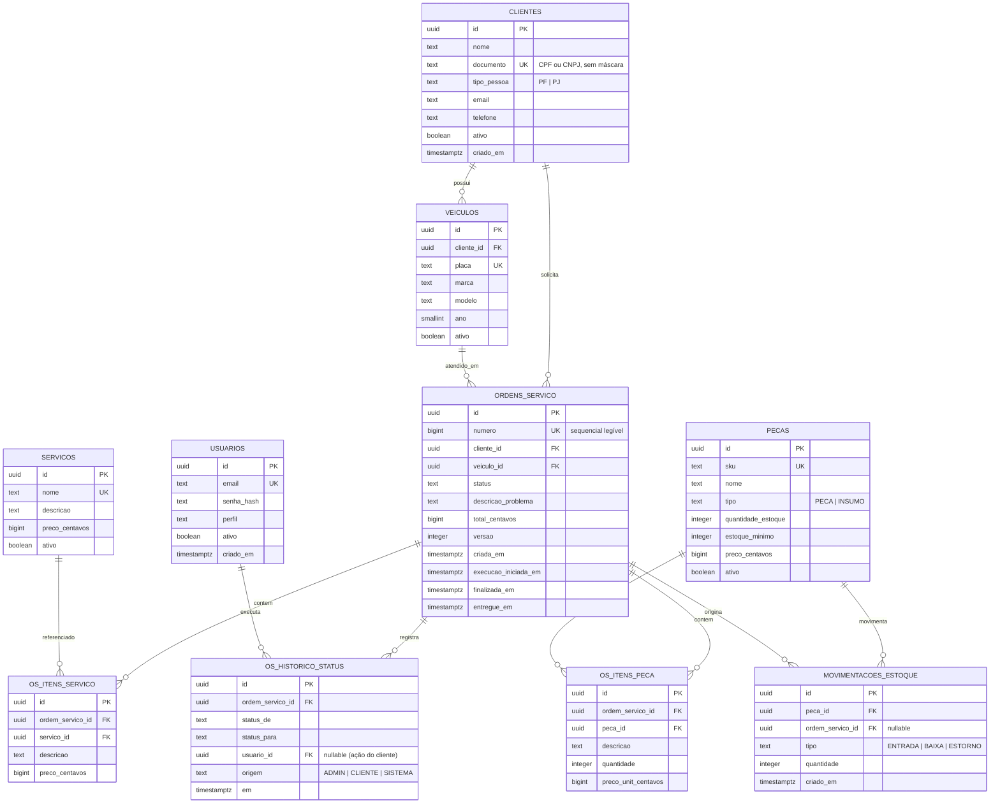

# 5. Modelo de dados e escolha do banco

## 5.1 Banco escolhido: PostgreSQL 16

### Justificativa

| Critério | Por que o PostgreSQL atende |
|----------|-----------------------------|
| **Consistência transacional (ACID)** | Aprovar orçamento e baixar estoque devem ocorrer juntos ou não ocorrer (RNF12) |
| **Natureza relacional dos dados** | Cliente → Veículo → OS → Itens são relações fortes, com integridade referencial |
| **Restrições declarativas** | `UNIQUE` (CPF/CNPJ, placa), `CHECK` (estoque ≥ 0, preços ≥ 0) reforçam as regras de negócio na última linha de defesa |
| **Concorrência** | MVCC e updates atômicos condicionais evitam estoque negativo |
| **Agregações** | `AVG`, `FILTER` e funções de janela suportam o tempo médio de execução direto em SQL |
| **Ecossistema Go** | Driver `pgx` maduro, `sqlc` e `golang-migrate` |
| **Custo e portabilidade** | Open source, imagem oficial Docker, amplamente disponível em nuvem |
| **Extensibilidade** | `JSONB` para eventuais dados semiestruturados; índices parciais e GIN |

### Alternativas consideradas

| Alternativa | Motivo da não escolha |
|-------------|----------------------|
| MySQL/MariaDB | Viável, porém com menos recursos de `CHECK`/índices parciais em versões antigas; sem ganho relevante aqui |
| MongoDB | Dados fortemente relacionais e necessidade de transações multi-entidade tornam o modelo documental menos adequado |
| SQLite | Simples, mas limita concorrência de escrita e não representa um ambiente de produção |
| Redis | Não é banco primário; poderia servir a cache em evolução futura |

## 5.2 Diagrama entidade-relacionamento



## 5.3 Decisões de modelagem

| Decisão | Motivo |
|---------|--------|
| **UUID** como PK | Evita enumeração de IDs em rotas públicas |
| **`numero` sequencial** na OS | Identificador legível para o cliente informar (usa `SEQUENCE`) |
| **Valores em centavos (`bigint`)** | Evita erro de ponto flutuante |
| **Snapshot de descrição e preço nos itens** | Reajustes no catálogo não alteram OS já emitidas (RN06) |
| **Inativação lógica** (`ativo`) | Preserva histórico (RN14) |
| **Documento sem máscara** | Comparação e unicidade consistentes |
| **`versao`** na OS | Controle otimista de concorrência |
| **Histórico de status** em tabela própria | Auditoria (RF11) |

## 5.4 Restrições e índices principais

```sql
-- Restrições que reforçam regras de negócio
ALTER TABLE pecas            ADD CONSTRAINT ck_estoque_nao_negativo CHECK (quantidade_estoque >= 0);
ALTER TABLE pecas            ADD CONSTRAINT ck_preco_peca CHECK (preco_centavos >= 0);
ALTER TABLE servicos         ADD CONSTRAINT ck_preco_servico CHECK (preco_centavos >= 0);
ALTER TABLE os_itens_peca    ADD CONSTRAINT ck_qtd_item CHECK (quantidade >= 1);
ALTER TABLE ordens_servico   ADD CONSTRAINT ck_status CHECK (status IN
  ('RECEBIDA','EM_DIAGNOSTICO','AGUARDANDO_APROVACAO','EM_EXECUCAO','FINALIZADA','ENTREGUE','CANCELADA'));

-- Índices
CREATE INDEX ix_os_status_criada     ON ordens_servico (status, criada_em);
CREATE INDEX ix_os_cliente           ON ordens_servico (cliente_id);
CREATE INDEX ix_veiculos_cliente     ON veiculos (cliente_id);
CREATE INDEX ix_os_finalizadas       ON ordens_servico (finalizada_em) WHERE finalizada_em IS NOT NULL;
```

## 5.5 Consulta do tempo médio de execução

```sql
SELECT AVG(finalizada_em - execucao_iniciada_em) AS tempo_medio
FROM ordens_servico
WHERE status IN ('FINALIZADA','ENTREGUE')
  AND execucao_iniciada_em IS NOT NULL
  AND finalizada_em BETWEEN $1 AND $2;
```

## 5.6 Migrations

Versionadas em `migrations/` (`000001_criar_tabelas.up.sql` / `.down.sql`) e aplicadas automaticamente na inicialização do contêiner ou por comando dedicado.
