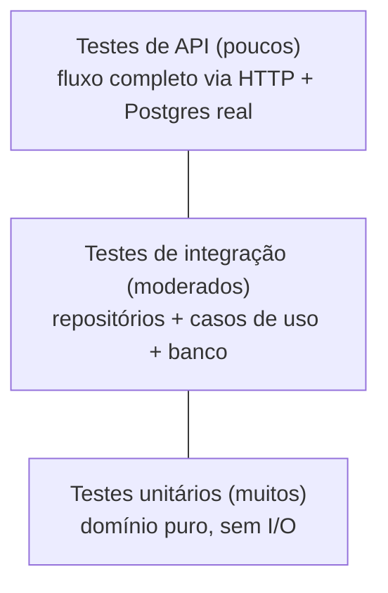

# 8. Qualidade e testes

## 8.1 Estratégia

Pirâmide de testes, com foco no **domínio crítico**.



| Nível | Alvo | Ferramentas | Banco |
|-------|------|-------------|-------|
| **Unitário** | Entidades, VOs, máquina de estados, cálculo de orçamento, validadores | `testing`, `testify`, tabelas de casos | Nenhum |
| **Unitário de aplicação** | Casos de uso com repositórios *fake*/mocks | `testify/mock` ou fakes manuais | Nenhum |
| **Integração** | Repositórios, transações, restrições, baixa de estoque concorrente | `testcontainers-go` | PostgreSQL real em contêiner |
| **API (fluxo)** | Handlers + JWT + casos de uso + banco | `httptest` | PostgreSQL real |

## 8.2 Domínios críticos (meta ≥ 80% de cobertura)

| Domínio crítico | Pacote | Justificativa |
|-----------------|--------|---------------|
| Ordem de Serviço | `internal/ordemservico/domain` e `application` | Core do negócio |
| Estoque | `internal/estoque/domain` e `application` | Integridade de quantidades |
| Validações (CPF/CNPJ, placa) | `internal/cadastro/domain` | Dados sensíveis |
| Identidade | `internal/identidade` | Segurança |

Cobertura medida por pacote; o pipeline **falha** abaixo de 80% nesses pacotes.

```bash
go test ./... -coverprofile=coverage.out
go tool cover -func=coverage.out
```

## 8.3 Casos de teste prioritários

**Domínio**

| ID | Caso |
|----|------|
| T01 | CPF/CNPJ válidos e inválidos (dígitos, repetidos, tamanho, máscara) |
| T02 | Placa antiga e Mercosul válidas; formatos inválidos |
| T03 | Cálculo do orçamento com múltiplos serviços e peças (RN06) |
| T04 | Toda transição válida da máquina de estados |
| T05 | Toda transição **inválida** retorna `ErrTransicaoInvalida` |
| T06 | Enviar orçamento sem serviço falha (RN05) |
| T07 | Alterar itens fora de Recebida/Diagnóstico falha (RN09) |
| T08 | Snapshot de preço não muda após reajuste do catálogo |
| T09 | Tempo de execução calculado com relógio falso |

**Aplicação**

| ID | Caso |
|----|------|
| T10 | Abrir OS com veículo de outro cliente falha (RN04) |
| T11 | Aprovar orçamento baixa estoque e muda status |
| T12 | Estoque insuficiente aborta a aprovação sem efeito colateral |
| T13 | Rejeição cancela a OS |
| T14 | Cliente com documento divergente recebe "não encontrado" (RN13) |

**Integração / API**

| ID | Caso |
|----|------|
| T15 | Unicidade de CPF/CNPJ e placa em nível de banco |
| T16 | Baixa concorrente de estoque (N goroutines) nunca produz saldo negativo |
| T17 | Rollback: falha na baixa desfaz a mudança de status |
| T18 | Rotas `/admin` retornam 401 sem token, 401 com token expirado/adulterado |
| T19 | **Fluxo completo**: login → cliente → veículo → serviço/peça → OS → orçamento → aprovação pública → finalizar → entregar |
| T20 | Métrica de tempo médio retorna valor esperado para dados conhecidos |

## 8.4 Boas práticas de qualidade de código

| Prática | Ferramenta / regra |
|---------|--------------------|
| Formatação | `gofmt` / `goimports` |
| Lint | `golangci-lint` (govet, staticcheck, errcheck, gosec, revive) |
| Vulnerabilidades | `govulncheck` |
| Injeção de dependência explícita | Construtores em `cmd/api`, sem estado global |
| Relógio e IDs injetáveis | Testes determinísticos |
| Erros | `errors.Is/As`, erros de domínio tipados, *wrapping* com contexto |
| Convenções | Nomes em português para o domínio (linguagem ubíqua), código de infraestrutura em inglês técnico **[Premissa]** |

## 8.5 Integração contínua (proposta)

Pipeline (GitHub Actions ou similar) a cada *push*:

1. `gofmt` e `golangci-lint`
2. `govulncheck`
3. `go test ./... -race -cover` (com Postgres via *service container*)
4. Verificação do limiar de 80% nos domínios críticos
5. Build da imagem Docker

## 8.6 Definition of Done

- [ ] Código revisado e sem alertas do lint
- [ ] Testes unitários e de integração passando
- [ ] Cobertura ≥ 80% nos domínios críticos
- [ ] Endpoint documentado no Swagger
- [ ] Migration criada (quando aplicável)
- [ ] Documentação atualizada
