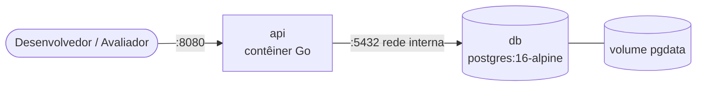

# 9. Infraestrutura e execução local

## 9.1 Componentes



## 9.2 Dockerfile (proposta)

Build *multi-stage*: compila em imagem Go e executa em imagem mínima, como usuário não-root.

```dockerfile
# ---- build ----
FROM golang:1.26-alpine AS build
WORKDIR /src
COPY go.mod go.sum ./
RUN go mod download
COPY . .
RUN CGO_ENABLED=0 go build -trimpath -ldflags="-s -w" -o /out/api ./cmd/api

# ---- runtime ----
FROM gcr.io/distroless/static-debian12:nonroot
COPY --from=build /out/api /api
EXPOSE 8080
USER nonroot:nonroot
ENTRYPOINT ["/api"]
```

## 9.3 docker-compose.yml (proposta)

```yaml
services:
  db:
    image: postgres:16-alpine
    environment:
      POSTGRES_DB: ${DB_NAME}
      POSTGRES_USER: ${DB_USER}
      POSTGRES_PASSWORD: ${DB_PASSWORD}
    volumes:
      - pgdata:/var/lib/postgresql/data
    healthcheck:
      test: ["CMD-SHELL", "pg_isready -U ${DB_USER} -d ${DB_NAME}"]
      interval: 5s
      timeout: 3s
      retries: 10

  api:
    build: .
    depends_on:
      db:
        condition: service_healthy
    environment:
      APP_PORT: 8080
      DATABASE_URL: postgres://${DB_USER}:${DB_PASSWORD}@db:5432/${DB_NAME}?sslmode=disable
      JWT_SECRET: ${JWT_SECRET}
      JWT_TTL_MINUTES: 60
      ADMIN_EMAIL: ${ADMIN_EMAIL}
      ADMIN_PASSWORD: ${ADMIN_PASSWORD}
    ports:
      - "8080:8080"

volumes:
  pgdata:
```

## 9.4 Variáveis de ambiente (`.env.example`)

| Variável | Descrição | Exemplo |
|----------|-----------|---------|
| `DB_NAME` | Nome do banco | `oficina` |
| `DB_USER` | Usuário do banco | `oficina` |
| `DB_PASSWORD` | Senha do banco | `troque-me` |
| `JWT_SECRET` | Segredo de assinatura (≥ 32 bytes) | `gere-um-valor-aleatorio` |
| `JWT_TTL_MINUTES` | Validade do token | `60` |
| `ADMIN_EMAIL` | Admin inicial (seed) | `admin@oficina.local` |
| `ADMIN_PASSWORD` | Senha do admin inicial | `troque-me` |
| `APP_PORT` | Porta HTTP | `8080` |
| `LOG_LEVEL` | Nível de log | `info` |

## 9.5 Execução local

**Pré-requisitos:** Docker e Docker Compose.

```bash
git clone <repositorio>
cd <repositorio>
cp .env.example .env          # ajuste os valores
docker compose up --build
```

| Recurso | URL |
|---------|-----|
| API | `http://localhost:8080/api/v1` |
| Swagger | `http://localhost:8080/swagger/index.html` |
| Health | `http://localhost:8080/health` |

**Executar testes**

```bash
go test ./... -race -cover                 # unitários
go test ./... -tags=integration            # integração (requer Docker para testcontainers)
```

**Regenerar Swagger**

```bash
swag init -g cmd/api/main.go -o docs/swagger
```

## 9.6 Conteúdo do README.md final (RNF08)

O README do repositório deverá conter: visão do projeto, pré-requisitos, passo a passo de execução, exemplo de fluxo com `curl`, como rodar testes, estrutura de pastas e link para esta documentação. O README atual já cumpre a função de índice.
