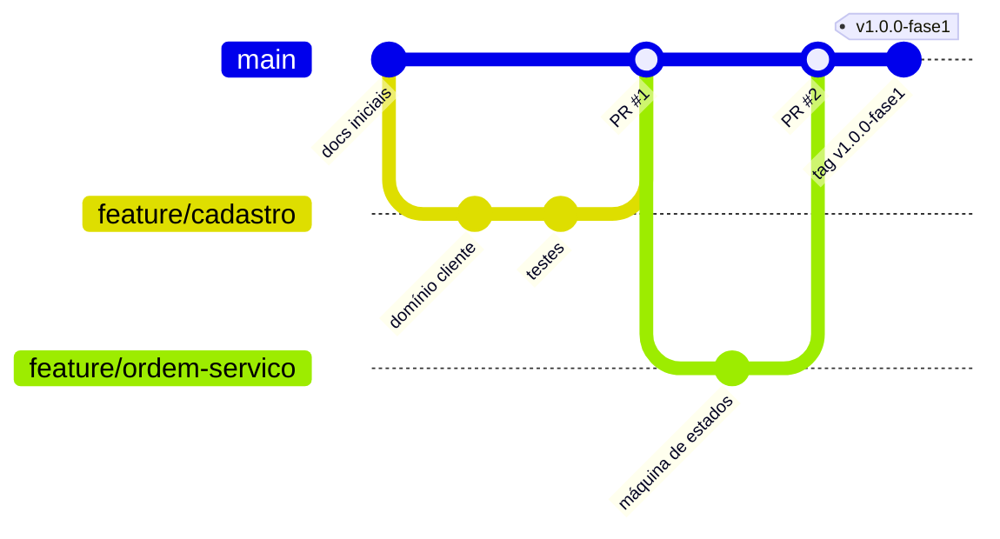

# 11. Entrega da Fase 1

A entrega é **um único arquivo PDF** com todas as informações e links. A correção considera código-fonte, documentação, vídeo e evidências, exclusivamente na versão (branch + hash) informada.

## 11.1 Estrutura do PDF

| Seção | Conteúdo |
|-------|----------|
| **Capa (1ª página)** | Ver 11.2 |
| **Repositórios** | Link completo e clicável de **todos** os repositórios, branch e hash do commit final |
| **Documentação** | Resumo e link para a documentação DDD e demais documentos |
| **Vídeo** | Link do vídeo da entrega |
| **Evidências** | Cobertura de testes, relatório de vulnerabilidades, Swagger, proteção da `main` e PRs |

## 11.2 Capa obrigatória

| Campo | Valor |
|-------|-------|
| Curso | SOAT — Software Architecture |
| Fase | 1 |
| Número do grupo | `<a preencher>` |
| Integrantes (nome completo) | `<a preencher>` |
| RM de cada integrante | `<a preencher>` |
| Username no Discord de cada integrante | `<a preencher>` |
| Linguagem e principais tecnologias | Go 1.26, PostgreSQL 16, chi, pgx/sqlc, JWT, Swagger (swaggo), Docker/Compose, testify/testcontainers |

## 11.3 Versão avaliada

| Campo | Valor |
|-------|-------|
| Repositório | `<URL pública no GitHub>` |
| Branch | `main` |
| Tag (opcional, recomendada) | `v1.0.0-fase1` |
| Hash do commit final | `<a preencher>` |

A branch, a tag e o hash devem corresponder ao código mostrado no vídeo e na documentação. Após o congelamento, **nenhum commit** deve ser adicionado à versão informada antes do fim da correção.

## 11.4 Checklist do repositório

- [ ] Público no GitHub durante correção e revisão de notas
- [ ] Versão identificada por branch, tag ou hash
- [ ] Código igual ao do vídeo e da documentação
- [ ] Somente arquivos necessários; **sem credenciais, senhas ou tokens** (`.env` no `.gitignore`, apenas `.env.example`)
- [ ] `README.md` completo (checklist em 11.5)
- [ ] Instruções suficientes para execução local
- [ ] Testes automatizados com cobertura ≥ 80% (evidência anexada)
- [ ] Documentação da API via Swagger/OpenAPI
- [ ] Relatório de análise de vulnerabilidades no repositório
- [ ] `main` protegida; tudo entra por Pull Request

## 11.5 Checklist do README.md

| Item exigido | Seção no [README](../README.md) | Status |
|--------------|-------------------------------|--------|
| Objetivo do projeto | 1 | Escrito |
| Descrição resumida da solução | 2 | Escrito |
| Arquitetura utilizada | 3 | Escrito |
| Tecnologias utilizadas | 4 | Escrito |
| Pré-requisitos | 5 | Escrito |
| Instruções para execução | 6 | Escrito (validar após implementação) |
| Instruções para execução dos testes | 7 | Escrito (validar após implementação) |
| Acesso ao Swagger | 8 | Escrito (validar após implementação) |
| Decisão e justificativa do banco | 9 | Escrito |
| Usuários/credenciais de demonstração ou autenticação | 10 | Escrito |
| Estrutura dos principais diretórios | 11 | Escrito (validar após implementação) |
| Link para a documentação DDD | 12 | Escrito |
| Link para o vídeo | 13 | **Pendente** |

## 11.6 Fluxo de Git e proteção da `main`

A `main` deve estar protegida; nada entra nela sem Pull Request.

**Configuração em GitHub → Settings → Branches → Branch protection rules (`main`):**

- [x] Require a pull request before merging
- [x] Require approvals (mínimo 1)
- [x] Require status checks to pass (lint, testes, cobertura, build)
- [x] Require branches to be up to date before merging
- [x] Do not allow bypassing the above settings
- [x] Restrict force pushes e deletions

**Fluxo de trabalho proposto**

| Item | Convenção **[Premissa]** |
|------|--------------------------|
| Branches | `feature/<contexto>-<resumo>`, `fix/...`, `docs/...` |
| Commits | Conventional Commits (`feat:`, `fix:`, `docs:`, `test:`) |
| PR | Descrição, requisitos atendidos (RF/RN), testes e evidências |
| Merge | Squash ou merge commit após aprovação e checks verdes |

## 11.7 Evidências a coletar

| Evidência | Como gerar | Onde guardar |
|-----------|------------|--------------|
| Cobertura ≥ 80% | `go test ./... -coverprofile=coverage.out` + `go tool cover -func` | `docs/relatorios/cobertura.md` e print no PDF |
| Vulnerabilidades | `govulncheck ./...` e `gosec ./...` | `docs/relatorios/vulnerabilidades.md` |
| Swagger | Print de `/swagger/index.html` | PDF |
| Proteção da `main` | Print das regras de branch | PDF |
| PRs mergeados | Lista de PRs | PDF |
| Vídeo | Demonstra execução, fluxo completo, testes e documentação | Link no README e no PDF |

## 11.8 Roteiro sugerido do vídeo

1. Apresentação do grupo e do problema (P1–P5).
2. Arquitetura e DDD (contextos, agregados, máquina de estados).
3. Subir o ambiente com `docker compose up`.
4. Fluxo completo pelo Swagger: login → cliente → veículo → serviço/peça → OS → orçamento → aprovação pelo cliente → finalizar → entregar.
5. Estoque e métrica de tempo médio.
6. Testes e cobertura.
7. Relatório de vulnerabilidades e proteção da `main`.

## 11.9 Pendências de identificação

`<número do grupo>`, nomes, RMs, usernames do Discord, URL do repositório, hash final e link do vídeo dependem do grupo.
